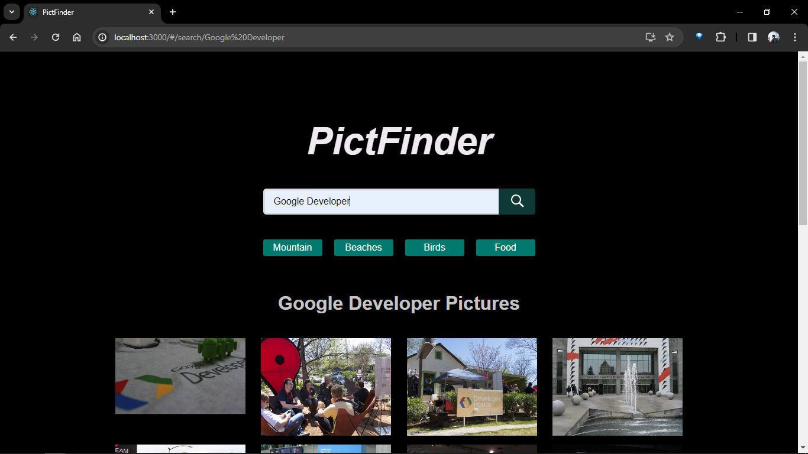
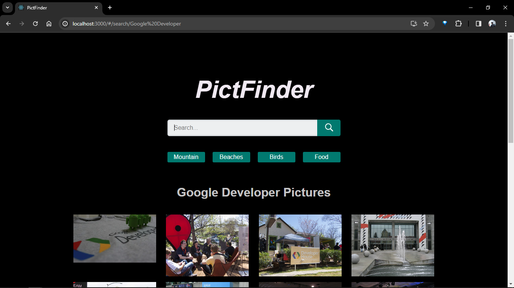
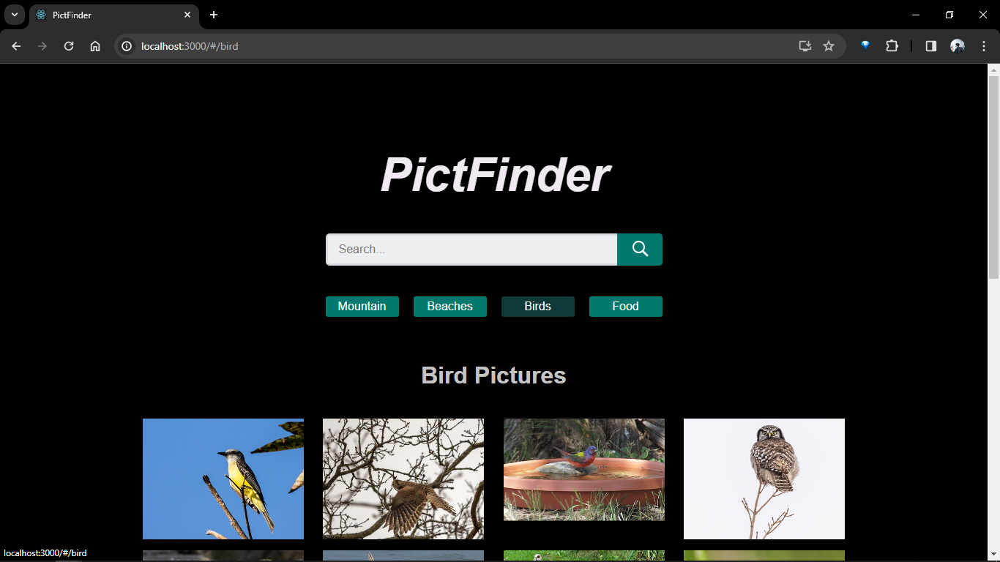

# Pict Finder Website

---

<strong>Topic 2: Front-end Development Task</strong>
 [GDSC ITB](https://gdsc.community.dev/institut-teknologi-bandung/)

---

## Task
1. Create a website using React. The type and theme of the website is given back to
member’s creativity. The chosen theme for the website should be adjusted to the next
task requirements.
2. The project should contain at least one page that displays a ‘list of images’. Several
idea recommendations for the website could be: a Snapshot page, a Movie List page,
or a Food Recommendation page. There is no maximum limit for the number of pages
that the project could contain while the minimum number of pages is one page.
3. The data provided for the project can be taken from a certain API (definition of API) or
manually collected by members. Please be sure to keep in mind the proper way to
fetch data from a certain API endpoint.
4. Implement ‘marked as Favorite’ features on the website. Objects that are ‘marked as
Favorite’ should be able to be displayed differently from the others. Members could
freely decide regarding the appearance of the ‘marked as Favorite’ objects, as long as
it is emphasized and easily differentiated.

---

## Website Preview

---

### Student Notes
For task point 4 (Implement ‘marked as Favorite’ features on the website. Objects that are ‘marked as
Favorite’ should be able to be displayed differently from the others. Members could
freely decide regarding the appearance of the ‘marked as Favorite’ objects, as long as
it is emphasized and easily differentiated..) I changed the task from previously creating a favorites feature to creating routes set for four default pages and one search page. (susah nyari tutornya bang 😭)

---

### Author
<strong>[Sulhan Fuadi](https://github.com/sulhanfuadi)</strong>
